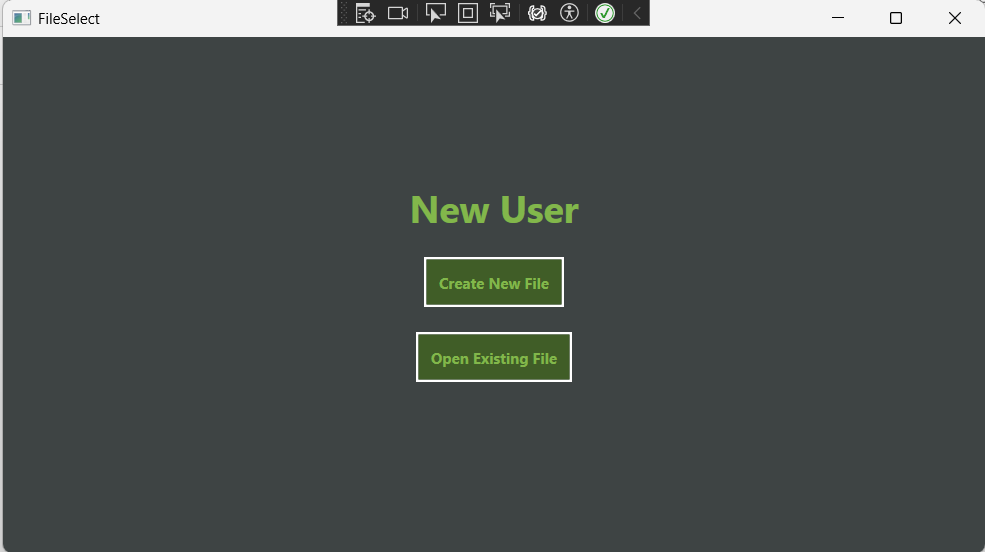
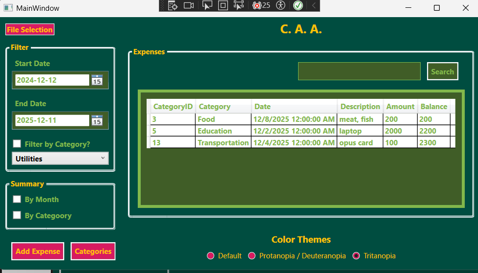
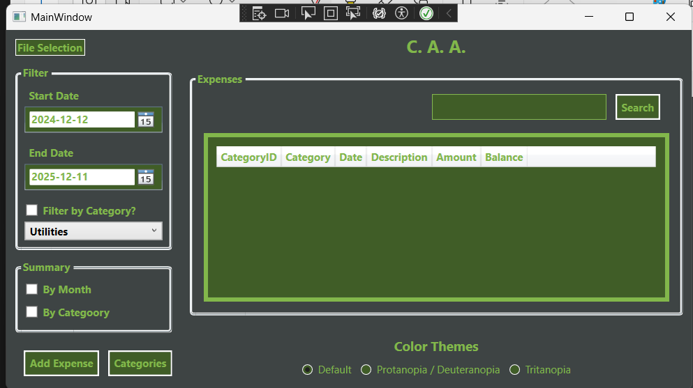
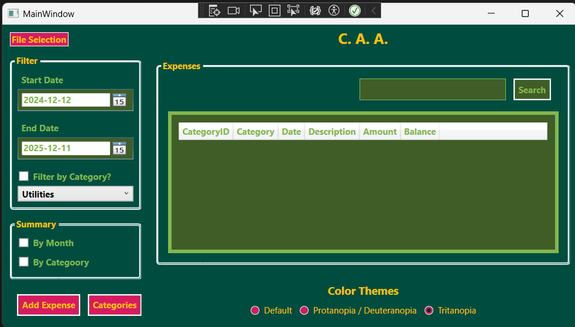

# HomeBudget_WindowApp_CuAri_Avengers

HomeBudget_WindowApp_CuAri_Avengers is a lightweight Windows desktop application (C#) for personal finance and home budgeting. It provides an easy way to track income, expenses, and budgets with a simple, user-friendly interface designed for everyday users.

## Team
- 
- 
- 

## Key features
- Track income and expenses by category
- Create and manage budgets
- View transaction history and simple summaries
- Local storage (no cloud required) — keeps your data on your machine

## Tech stack
- Language: C#
- Platform: Windows desktop application (Visual Studio / .NET)
- Data storage: local file or lightweight embedded database (implementation detail in repo)

## Getting started
Prerequisites:
- Windows 10/11
- .NET (version matching the project) and Visual Studio 2019/2022 or newer

Quick start:
1. Clone the repository:
   git clone https://github.com/cuongngodev/HomeBudget_WindowApp_CuAri_Avengers.git
2. Open the solution file (.sln) in Visual Studio.
3. Build the solution and run the project (F5).

## Screenshots
Below are some screenshots from the app. These show the main UI, dashboards and reports.

